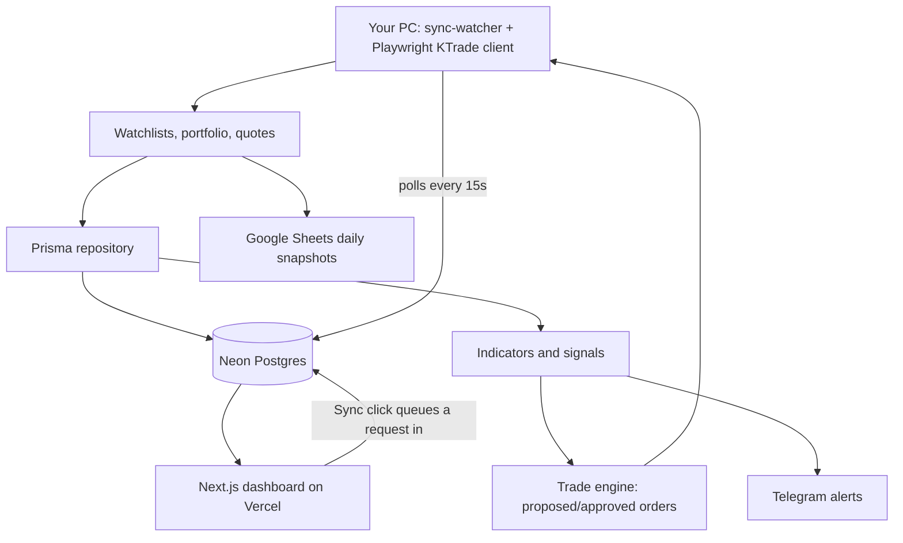

# Tradr Cloud

Cloud dashboard (Vercel + Neon) paired with a local KTrade collector: Prisma-backed
history, technical indicators, and an auto buy/sell engine driven by your own
+/- % thresholds. The dashboard, database, and order approvals are fully cloud —
only KTrade's browser login runs locally, from your own PC, so logins look like
you logging in manually rather than an automated datacenter host.

See [DEPLOY.md](./DEPLOY.md) for the full setup (Neon → Vercel → local sync-watcher).

## Architecture



## Why the collector runs locally, not in the cloud

KTrade logins originally ran from GitHub Actions runners. That failed for two
reasons worth knowing if you're tempted to move it back to a cloud host:

- **Reliability:** GitHub-hosted runners use well-known datacenter IP ranges;
  KTrade intermittently timed out or blocked navigation from them.
- **Account risk:** even when it worked, repeated automated logins from a foreign
  datacenter IP are exactly the pattern brokers flag as suspicious. Logging in from
  your own home network — the same network you'd use manually — avoids that.

Everything that doesn't need a real login (dashboard, database, order approval,
settings) stays fully cloud and works from any device.

## Local development / running the watcher

```bash
cp .env.example .env   # fill in DATABASE_URL + KTRADE_* for local use
npm install
npx prisma db push       # sync the schema to your Neon database
npm run playwright:install
npm run dev              # dashboard at http://localhost:3000
npm run sync-watcher      # keeps polling for Sync requests + runs scheduled collection
```

`npm run collector` runs the KTrade collector once, on demand, without the polling loop.

When `VERCEL=1` is not set (i.e. running `next dev`/`next start` locally), the dashboard's
Sync button runs the collector in-process directly. In production on Vercel it always
queues a request in Neon for the local `sync-watcher` to pick up instead.

To keep the watcher running automatically on Windows without a terminal open, see the
Scheduled Task registration in [DEPLOY.md](./DEPLOY.md#3-local-sync-watcher-your-pc).

## KTrade integration notes

The KTrade web app is isolated in [src/services/ktrade/client.ts](src/services/ktrade/client.ts).
It first captures authenticated JSON responses whose URLs match:

- `KTRADE_WATCHLIST_URL_PATTERN`
- `KTRADE_PORTFOLIO_URL_PATTERN`
- `KTRADE_QUOTES_URL_PATTERN`

If you find a direct quotes JSON endpoint, set `KTRADE_QUOTES_API_URL` to skip page
navigation entirely for quotes. Otherwise the client falls back to capturing JSON
responses, then to scraping KTrade's "DEFAULT WATCH" market-watch table
(`table.watchTable`) via the same "Watches" hover menu already used for the portfolio.

Credentials are read only from environment variables (your local `.env`, never
committed). The authenticated session is cached at `KTRADE_SESSION_STATE_PATH`
(default `playwright/.auth/ktrade.json`), so the watcher doesn't need to log in from
scratch on every poll.

## Refresh and scheduling

KTrade login/collection only starts through the guarded collection path — never on
dashboard page load.

By default:

- The dashboard **Sync** button is enabled and queues a run whenever you press it;
  the local `sync-watcher` picks it up within ~15 seconds.
- Automatic scheduled collection runs from the same `sync-watcher` process
  (per-minute cron, gated by the dashboard's Settings tab: weekdays, start/end
  time, timezone, interval).

## Auto buy/sell

The **Trading** tab (`TradeSettings` + `Order` models) turns your existing +/- %
signal thresholds into buy/sell order proposals every collection run:

- Guardrails are enforced server-side: max value per order, max orders per day, one
  order per symbol+side per day, and a hard `AUTO_TRADE_LIVE` + dashboard toggle gate
  before anything is placed with the broker.
- Orders default to **confirm** mode — you approve/reject each one from the dashboard.
  Turn on **auto-approve** once you trust the thresholds, and only then enable **live
  execution** to actually place orders via KTrade's order ticket
  (configure `KTRADE_ORDER_SELECTORS_JSON` — verify first with
  `npm run ktrade:inspect-order-ticket`, which fills the ticket but never submits).
- Run `npm run backtest [SYMBOL]` before trusting any of this with real money — it
  replays the quant signal engine walk-forward over recorded price history
  (no lookahead) and reports win rate / average return per trade, using both
  price return and dividends received while a position was held.

## Historical data (prices, dividends, full symbol directory)

The organic daily collector alone would take years to build up enough history for
indicators like SMA50 to mean anything. Instead, backfill real history directly
from PSX's own public data — free, no login required:

```bash
npm run sync-symbol-directory        # all 745 PSX-listed equities: symbol, name, sector
npm run backfill-history [SYMBOL...]  # ~5 years of daily OHLCV per symbol (dps.psx.com.pk)
npm run backfill-dividends [SYMBOL...] # ~5 years of dividend payouts per symbol (stockanalysis.com)
```

With no symbol arguments, `backfill-history`/`backfill-dividends` run against every
symbol currently in the `Ticker` table — after `sync-symbol-directory` that's all 745,
so pass explicit symbols (or run it before the directory sync) to scope it to just
your portfolio/watch list. `sync-symbol-directory` only populates name/sector — it
does not add those symbols to the active collection/signals/AI-advisor loop, which
stays scoped to your portfolio + KTrade watch list to keep sync runs fast.

Dividends feed two things: total-return-aware backtesting (price return alone
understates real returns for dividend payers), and an "attractive yield" signal
(trailing 12-month yield ≥ 8%) that also gets passed to the AI advisor's prompt.

## AI advisor (optional, free)

[src/services/ai-advisor.ts](src/services/ai-advisor.ts) is a second-opinion
reasoning layer with three interchangeable providers, tried in this order —
first one configured wins:

1. **Groq** (`GROQ_API_KEY`) — free tier, fast, no billing card required. Sign
   up at [console.groq.com](https://console.groq.com/keys).
2. **Gemini** (`GEMINI_API_KEY`) — free tier, but Google requires linking a
   billing account (no charge while under free limits) before quota activates —
   get a key at [aistudio.google.com/apikey](https://aistudio.google.com/apikey).
3. **Ollama** (local, default) — install from [ollama.com](https://ollama.com),
   run `ollama pull qwen2.5:7b` (or any model you prefer), and it just works —
   no signup, no key, fully private. This is what runs if neither key above is set.

It calls the provider **once per candidate symbol**, not one batched call for
everything — small local models were observed silently dropping items from
multi-symbol batches, so single-symbol prompts trade a few extra round-trips
(free/instant for local Ollama) for much better reliability.

Two things worth understanding about how it's wired in:

- **It never originates trades.** The quant engine (SMA/RSI/MACD/Bollinger/
  momentum/volume/support-resistance signals, plus your +/- % thresholds) is what
  decides whether an order gets proposed at all. The AI only attaches a
  confidence + written rationale to that decision.
- **It can pause auto-approve.** If the AI's opinion meaningfully disagrees with
  a quant-triggered proposal (e.g. quant says sell, AI says buy at >50%
  confidence), that order is held for manual review even if auto-approve is on.
- Broader opinions across your whole watched universe (not just symbols that
  triggered a trade proposal) show up under **Trading → AI opinions**, along
  with an on-demand "ask about a symbol" box.
- Configurable trading horizon (daily/weekly/monthly) shapes both the AI prompt
  framing and shows up in the Trading tab settings.

This is a synthesis layer, not a price predictor — no model, free or otherwise,
reliably beats the market on short-term price direction. Treat its output as a
second opinion to review, the same way you'd treat any single analyst's take.

## Alerts

Telegram alerts use `TELEGRAM_BOT_TOKEN` and `TELEGRAM_CHAT_ID`. Rules are stored in the
`AlertRule` table; supported rule types are `price`, `day_change_percent`, and `volume`,
with operators `>`, `>=`, `<`, `<=`, `=`.

## Google Sheets

Google Sheets sync appends rows to `DailySnapshots!A:G`: `Date, Ticker, Open, High, Low, Close, Volume`.
Use a Google service account, share the target spreadsheet with its client email, and set
the `GOOGLE_SHEETS_*` env vars from `.env.example`.
