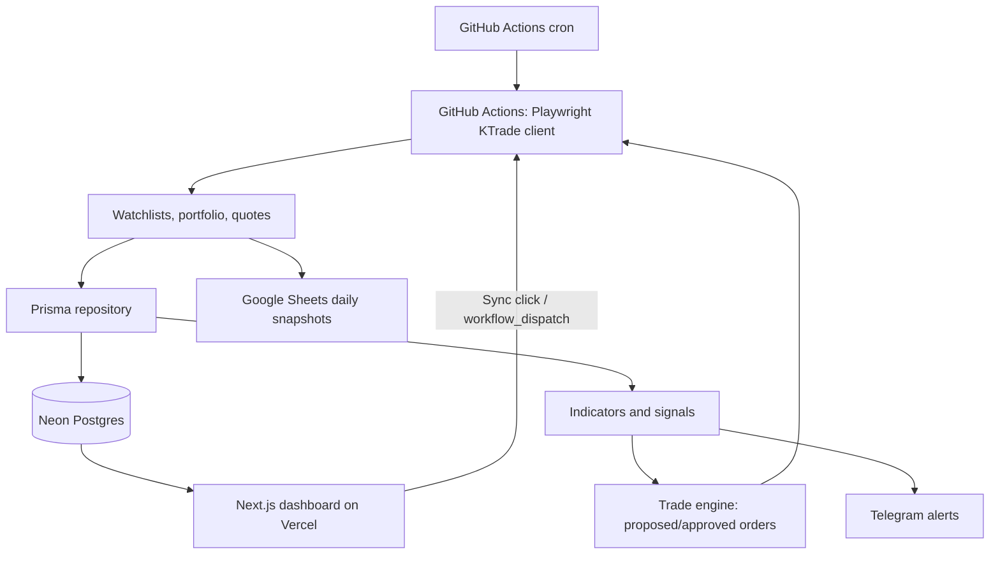

# Tradr Cloud

Fully cloud version of Tradr: KTrade automation, Prisma-backed history, technical
indicators, a Next.js dashboard, and an auto buy/sell engine driven by your own
+/- % thresholds. Nothing needs to run on your own machine — collection runs on
GitHub Actions, the dashboard runs on Vercel, both share one Neon Postgres database.

See [DEPLOY.md](./DEPLOY.md) for the full setup (Neon → GitHub secrets → Vercel).

## Architecture



## Why cloud-only

- **Speed:** the KTrade client hits captured JSON endpoints directly where possible, and
  uses event-driven waits (`waitForResponse`/`waitForSelector`) instead of fixed sleeps —
  a sync that used to take ~45s of scripted delay now only waits on real data.
- **No local process required:** GitHub Actions runs the browser-based collector on a
  cron schedule and on-demand (triggered by the dashboard's Sync button via the GitHub API).
  Vercel never launches a browser — it only reads/writes Neon.
- **Batched writes:** DB writes use `createMany`/transactions instead of per-row upserts,
  which matters a lot once the database is a network hop away (Neon) rather than local SQLite.

## Local development

You can still run the dashboard locally against the same Neon database for development:

```bash
cp .env.example .env   # fill in DATABASE_URL + KTRADE_* for local testing
npm install
npx prisma db push       # sync the schema to your Neon database
npm run playwright:install
npm run dev              # dashboard at http://localhost:3000
npm run collector        # run the KTrade collector once, locally
```

When `VERCEL=1` is not set, the dashboard's Sync button runs the collector in-process
(convenient for local testing). In production on Vercel it always queues a GitHub Actions run instead.

## KTrade integration notes

The KTrade web app is isolated in [src/services/ktrade/client.ts](src/services/ktrade/client.ts).
It first captures authenticated JSON responses whose URLs match:

- `KTRADE_WATCHLIST_URL_PATTERN`
- `KTRADE_PORTFOLIO_URL_PATTERN`
- `KTRADE_QUOTES_URL_PATTERN`

If you find a direct quotes JSON endpoint, set `KTRADE_QUOTES_API_URL` to skip page
navigation entirely for quotes. Otherwise the client falls back to capturing JSON
responses during a single dashboard navigation, then to table scraping.

Credentials are read only from environment variables/GitHub secrets. The authenticated
session is cached at `KTRADE_SESSION_STATE_PATH` (default `playwright/.auth/ktrade.json`)
and persisted between GitHub Actions runs via `actions/cache`.

## Refresh and scheduling

KTrade login/collection only starts through the guarded collection path — never on
dashboard page load.

By default:

- The dashboard **Sync** button is enabled and queues a run whenever you press it.
- Automatic scheduled collection follows the cron in
  [.github/workflows/collect.yml](.github/workflows/collect.yml) (PSX hours, Mon–Fri),
  but is still gated server-side by the dashboard's collection-window settings
  (weekdays, start/end time, timezone, interval) — edit those from the Settings tab.

## Auto buy/sell

The **Trading** tab (`TradeSettings` + `Order` models) turns your existing +/- %
signal thresholds into buy/sell order proposals every collection run:

- Guardrails are enforced server-side: max value per order, max orders per day, one
  order per symbol+side per day, and a hard `AUTO_TRADE_LIVE` + dashboard toggle gate
  before anything is placed with the broker.
- Orders default to **confirm** mode — you approve/reject each one from the dashboard.
  Turn on **auto-approve** once you trust the thresholds, and only then enable **live
  execution** to actually place orders via KTrade's order ticket
  (configure `KTRADE_ORDER_SELECTORS_JSON`).

## Alerts

Telegram alerts use `TELEGRAM_BOT_TOKEN` and `TELEGRAM_CHAT_ID`. Rules are stored in the
`AlertRule` table; supported rule types are `price`, `day_change_percent`, and `volume`,
with operators `>`, `>=`, `<`, `<=`, `=`.

## Google Sheets

Google Sheets sync appends rows to `DailySnapshots!A:G`: `Date, Ticker, Open, High, Low, Close, Volume`.
Use a Google service account, share the target spreadsheet with its client email, and set
the `GOOGLE_SHEETS_*` env vars from `.env.example`.
